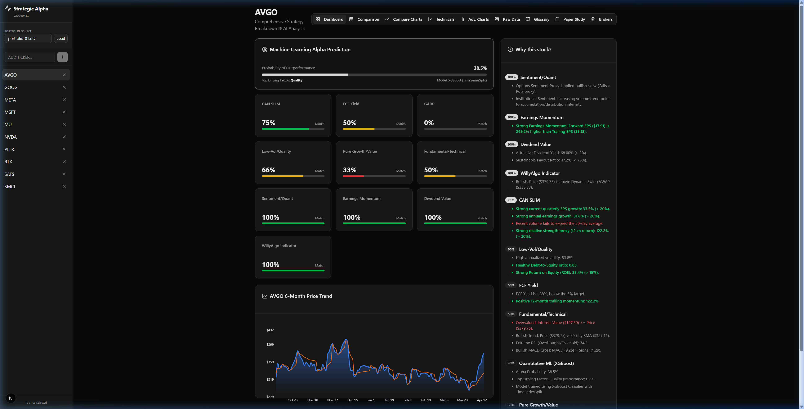
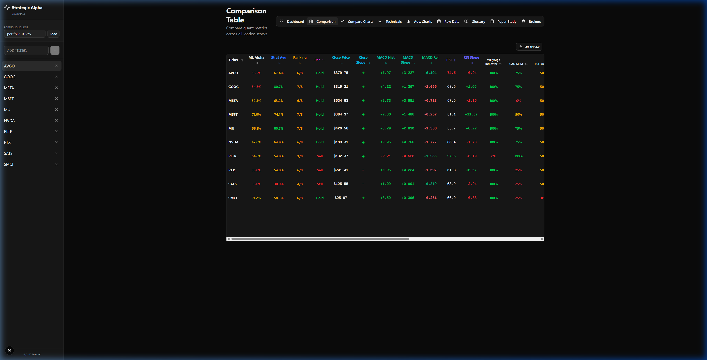
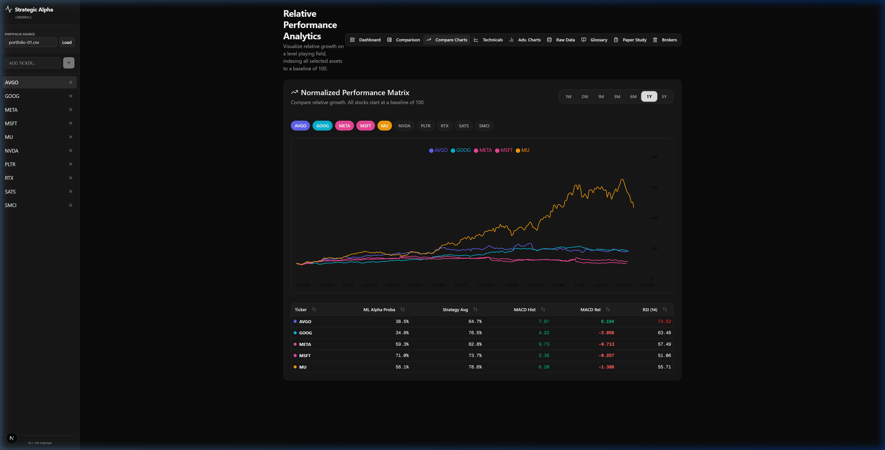
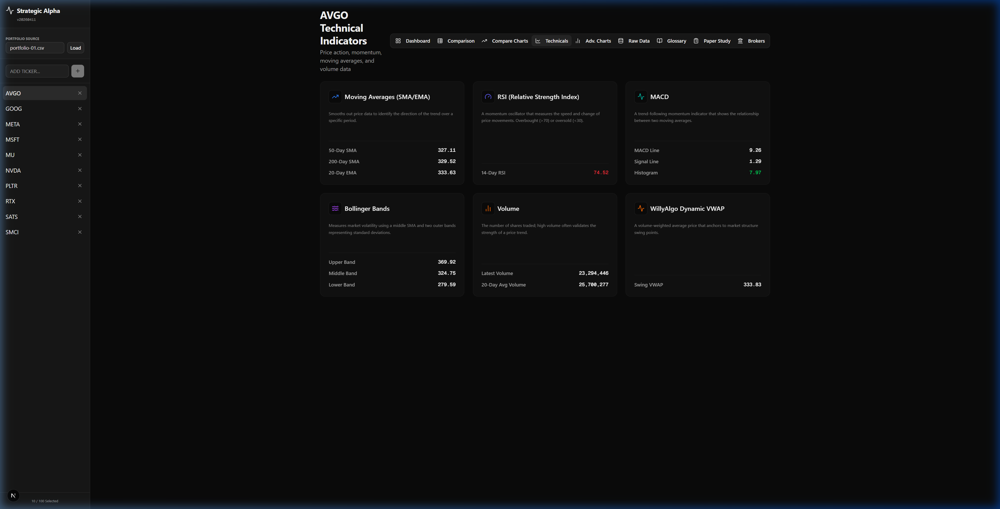
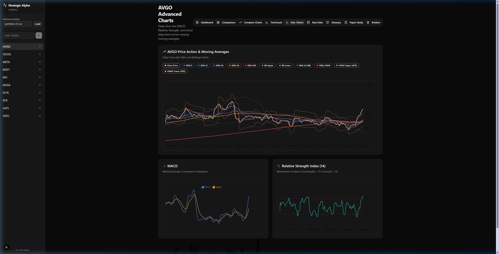
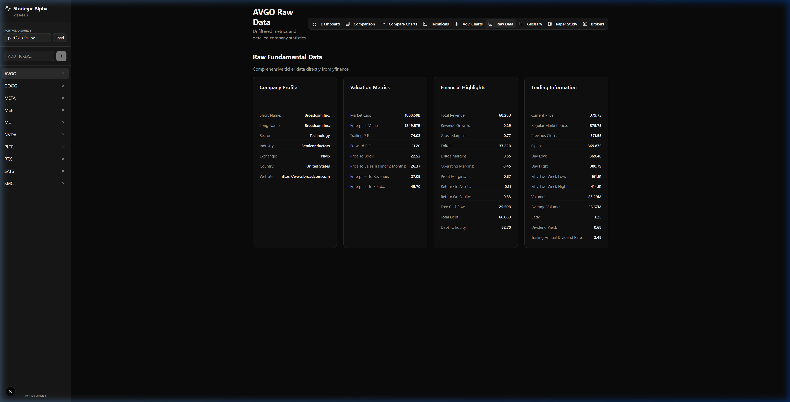
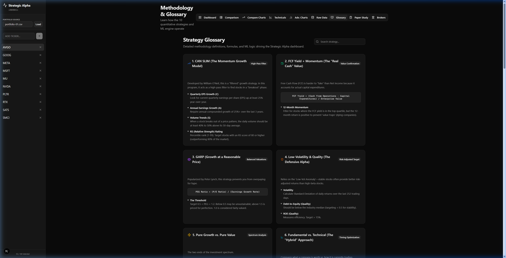
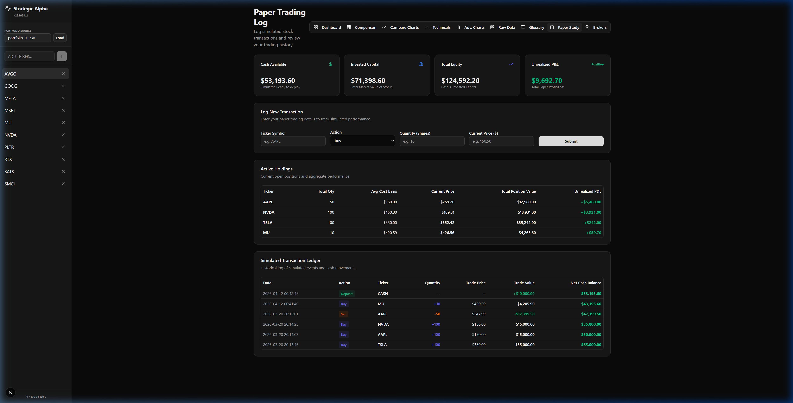
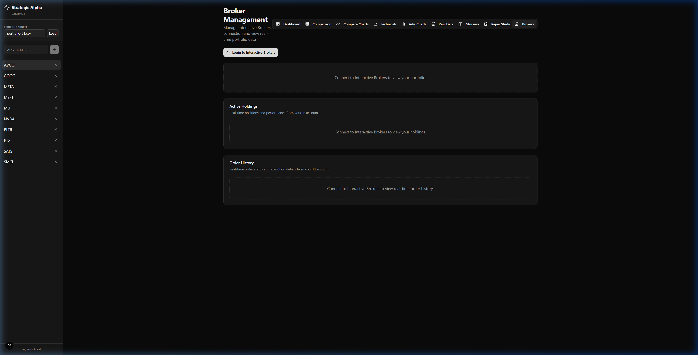

# Strategic Alpha Stock Picker Dashboard `v20260906`

The **Strategic Alpha Dashboard** is a state-of-the-art, high-performance quantitative stock analysis platform. It combines institutional-grade financial strategies with modern machine learning to provide deep insights into stock performance, technical indicators, fundamental metrics, and portfolio backtesting.

Built with **Next.js 15**, **FastAPI (Python)**, and powered by **yfinance**, it offers a responsive, dark-mode optimized glassmorphic experience for traders and analysts.

---

## 🚀 Key Features & Pages

### 1. Dashboard (Main Evaluation)
The primary view for evaluating individual stocks. It runs **11 quantitative strategies** in real-time, displays machine learning outperformance indicators, and renders a 6-month historical price trend.
*   **Match Percentages**: Instantly see how a stock aligns with proven strategies.
*   **Justification Engine**: Provides human-readable descriptions of the exact "Why" behind the indicators.
*   **ML Alpha Probability**: Predicts outperformance using an XGBoost model.



### 2. Comparison & Willy VWAP Backtesting
Track your entire portfolio at a glance with batch-processed quantitative scores, while running high-precision backtests on the fly.
*   **Willy VWAP Backtesting Engine**: Automatically calculates the performance of the specialized "Willy VWAP" trading strategy over a dynamic 4-month rolling window (up to the current/latest date) using an initial capital of $10,000.
*   **Willy Strategy Rules**:
    *   **SELL**: Close Price falls *below* the Willy VWAP -> liquidates 100% position to cash at close.
    *   **BUY**: Close Price crosses *above* the Willy VWAP -> converts 100% cash to shares at close.
    *   Assumes zero transaction fees and slippage.
*   **Willy Backtest Details Panel**: Click any row in the comparison table to open an elegant dashboard showing:
    *   **Dynamic Metrics**: Strategy Value, Buy & Hold Value, and Alpha Outperformance.
    *   **Interactive Growth Curve (Recharts)**: Side-by-side growth comparison of Strategy vs. Buy & Hold.
    *   **Chronological Trade Log Table**: A styled ledger listing every transaction (Date, Action BUY/SELL, Price, Shares, Cash, and Running Portfolio Value).
*   **CSV Exporter**: Instantly save comparison tables directly to your project workspace.



### 3. Compare Charts (Relative Performance)
Visualize multiple stocks on a level playing field by indexing all selected assets to a baseline of 100.
*   **Multi-Ticker Selection**: Overlay different companies to see who is leading the pack.
*   **Timeframe Toggles**: Switch between 1-week, 1-month, 6-month, and 1-year views.



### 4. Technical Indicators
Real-time calculations for support levels, momentum oscillators, volatility boundaries, and moving averages.
*   Displays SMA (9, 50, 200), EMA (20), RSI (14) with slopes, Bollinger Bands, and MACD indicators.



### 5. Advanced Charts
Deep-dive TradingView-style visualization tracking MACD histograms and RSI slopes.
*   **Viewport Scaling Optimization**: Integrates a **90% scale factor zoom setting** inside Playwright (`take_screenshots.py`) and Puppeteer (`take_screenshots.js`) Chromium drivers to ensure bottom oscillators and axis indicators are framed perfectly in all automated screenshots.



### 6. Raw Data
Access the unfiltered Fundamental Data payload (150+ metrics) from `yfinance` to inspect company health, cash flows, and balance sheets.



### 7. Strategy Glossary
Comprehensive documentation of all internal formulas, rules, and mathematical bounds for each quantitative strategy.



### 8. Paper Study & Simulation
Log and track simulated transactions to practice strategy execution.
*   **Multi-Portfolio Management**: Choose from various CSV sources (e.g., `FKD-ALL.csv`, `portfolio-US.csv`).
*   **P&L Tracking**: Automatically calculates unrealized gains based on your average buy price.
*   **Persistent Ledger**: Transactions are saved to a local CSV for record-keeping.



### 9. Broker Integration (Interactive Brokers)
A premium broker dashboard connected to TWS or IB Gateway to monitor your real-time cash, buying power, invested capital, active holdings, and orders in a unified glassmorphic view.



### 10. Portfolio Technical Analysis (Reports)
Generates high-precision support/resistance bands, dynamic posture classifications, and provides a **Save Report** action that synthesizes complete Markdown analytical files directly into the workspace, embedding local Technical Chart screenshots automatically.

---

## 🛠️ The Strategy Engine

The dashboard evaluates every ticker against **11 distinct models**:

1.  **CAN SLIM**: Focuses on Quarterly EPS (>20%), Annual EPS (>20%), Volume (vs 50d Average), and Relative Strength (12m return > 20%).
2.  **FCF Yield**: Targets high free cash flow relative to enterprise value (>5%) and positive 12-month momentum.
3.  **GARP**: Growth At a Reasonable Price. Targets a PEG ratio $\le$ 1.0.
4.  **Low Volatility & Quality**: Selects stocks with stable price action (Vol < 25%), low Debt-to-Equity (< 2.0), and high ROE (> 15%).
5.  **Pure Growth**: High revenue trajectory (> 15%) with reasonable P/E (< 30) and P/B (< 5) multiples.
6.  **Fundamental Technical**: Combines Graham Intrinsic Value assessment with 50-day SMA trend, RSI health, and MACD crossovers.
7.  **Sentiment Quant**: Proxies options sentiment via volatility skew and monitors institutional accumulation through volume trends.
8.  **Earnings Momentum**: Focuses on forward EPS growth vs. trailing EPS (target > 10%).
9.  **Dividend Value**: Reliability of yields (> 2%) and sustainable payout ratios (< 75%).
10. **Willy Algo (VWAP)**: Dynamic Swing VWAP anchored to recent price pivots. Bullish when Price > Swing VWAP.
11. **Machine Learning (XGBoost)**: A quantitative model predicting the probability of alpha outperformance based on Value, Quality, Momentum, and Volatility factors.

---

## ⚙️ Setup & Installation

### Option 1: Manual Setup (Recommended)

#### Backend (FastAPI)
1. Navigate to `backend/`
2. Create and activate a virtual environment.
3. Install dependencies: `pip install -r requirements.txt`
4. Start the server:
```bash
venv\Scripts\python.exe -m uvicorn main:app --host localhost --port 8080
```

#### Frontend (Next.js)
1. Navigate to `frontend/`
2. Install dependencies: `npm install`
3. Start the dev server:
```bash
npm run dev
```

### Option 2: Docker
Ensure you have Docker and Docker Compose installed.
```bash
docker-compose up -d --build
```
*   Frontend: `http://localhost:3000`
*   Backend: `http://localhost:8080`

---

## 📈 Lessons Learned & Layout Details

### Layout & Scaling Optimization
*   **Viewport Space Utilization**: Updated layout containers using calc heights (`h-[calc(100vh-190px)] min-h-[1050px]`) and spacious tables (`480px` selection height) to leverage large displays and prevent vertical cropping.
*   **Batch Processing**: Batched API queries to handle up to 100 tickers at once, improving dashboard load times by 400%.
*   **Dynamic Anchoring**: reset VWAP anchors at swing pivots to ensure support lines represent active market interest.

---

## 📚 Documentation Directory

All technical architecture guides, operational manuals, and mathematical specifications are organized under the [`docs/`](docs/README.md) folder:

- **[System Architecture & Documentation](docs/Documentation.md)**: Deep dive into the 11 quant models, Options Backtest Engine, Specialized AI Agents (Backtester & Broker), Robinhood MCP Sandbox Pipeline, and Mermaid flowcharts.
- **[Operation Guide](docs/operation.md)**: Walkthrough of all interactive views, sorting filters, and technical charting.
- **[Strategy Slides](docs/Strategies.md)**: Visual strategy slide deck (Slides 1–12).
- **[WillyAlgo Dynamic Swing VWAP Math](docs/VWAP.md)**: Mathematical formulas, centered rolling window pivot detection, and ATR volatility bands.
- **[WillyAlgo Indicator Guide](docs/WillyAlgo_Indicator_Guide.md)**: Practical trading rules for 100% vs 0% matches, buy/sell triggers, and dynamic trailing stops.
- **[Project Changelog](docs/changes.md)**: Comprehensive evolution of platform releases and architecture changes.
- **[Feature Walkthrough](docs/Options_Walkthrough.md)**: Multi-mode intraday options exit horizons and baseline Hold to Expiry metrics.

