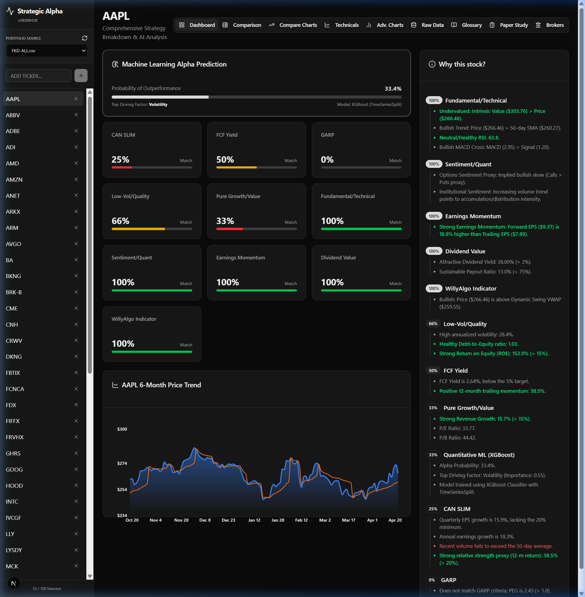
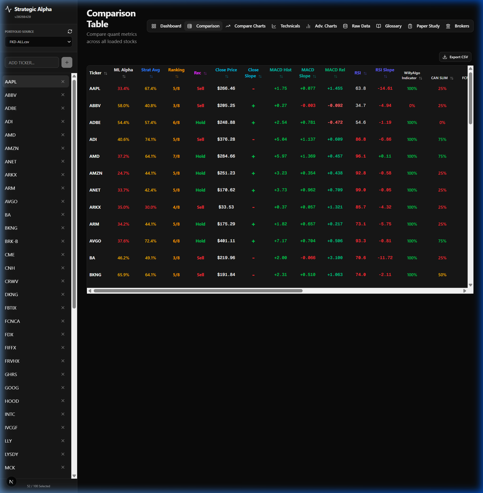
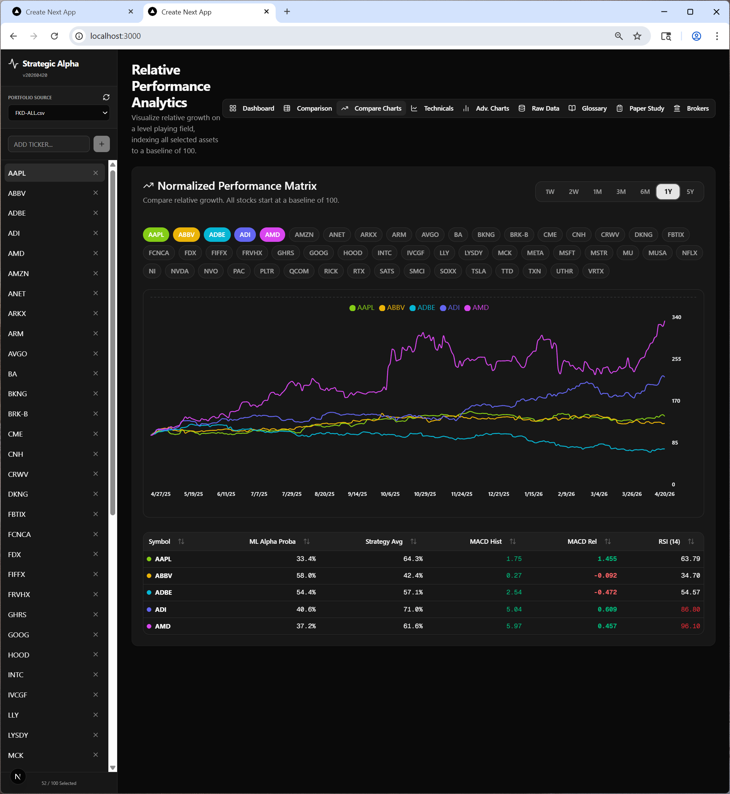
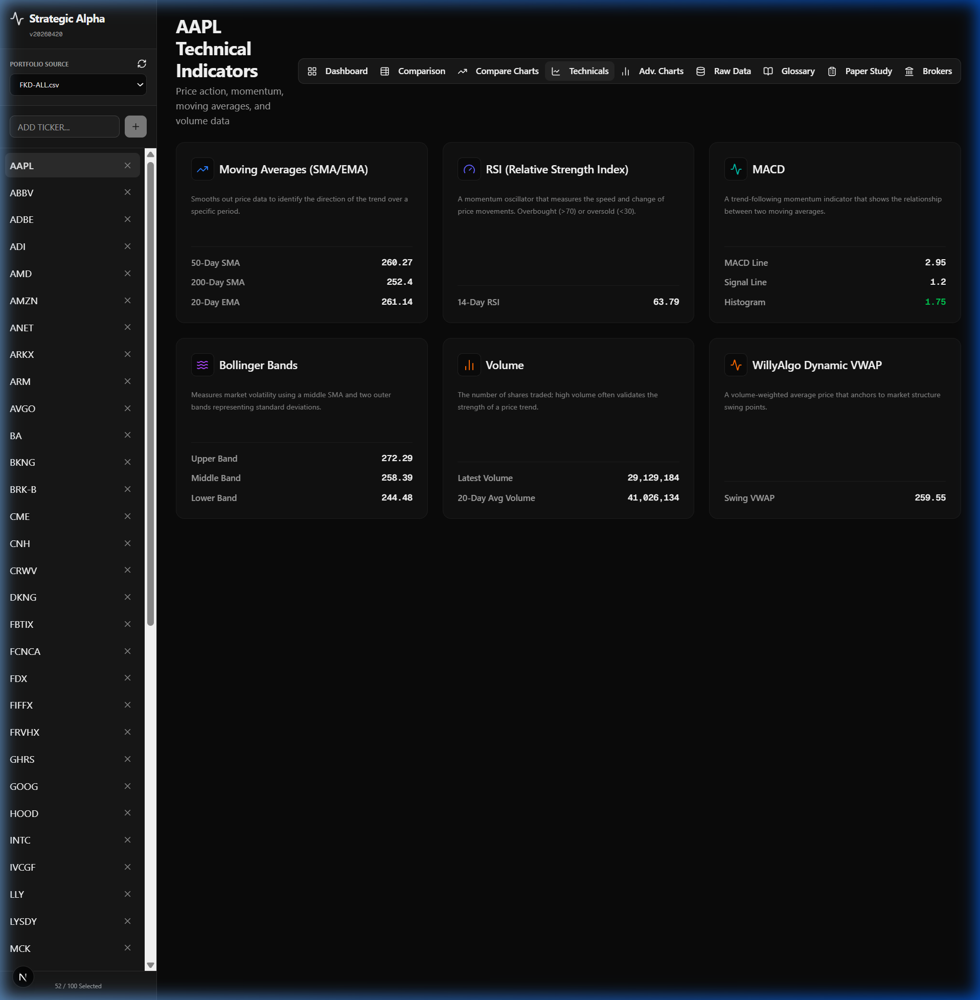
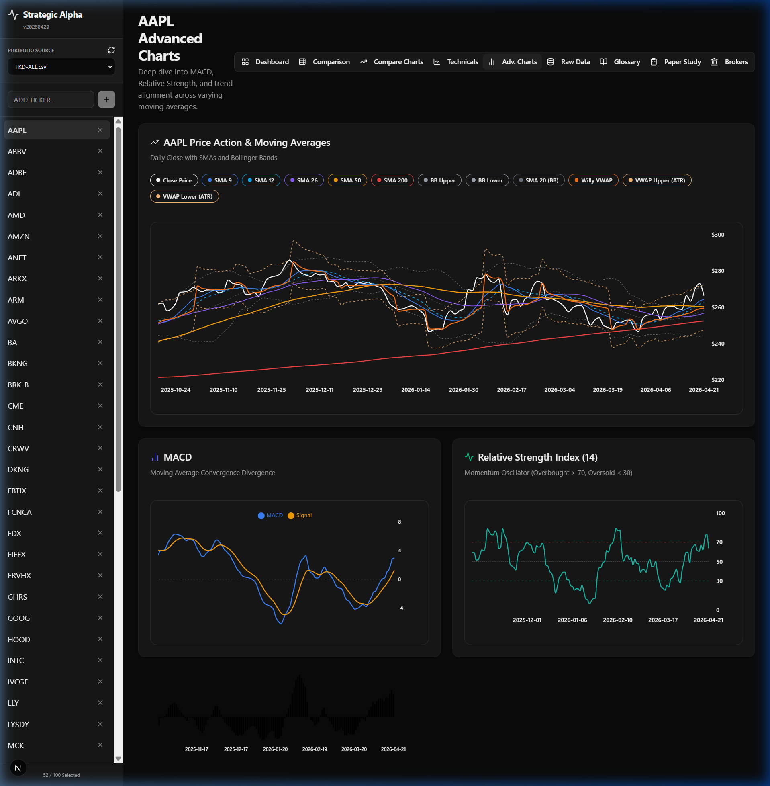
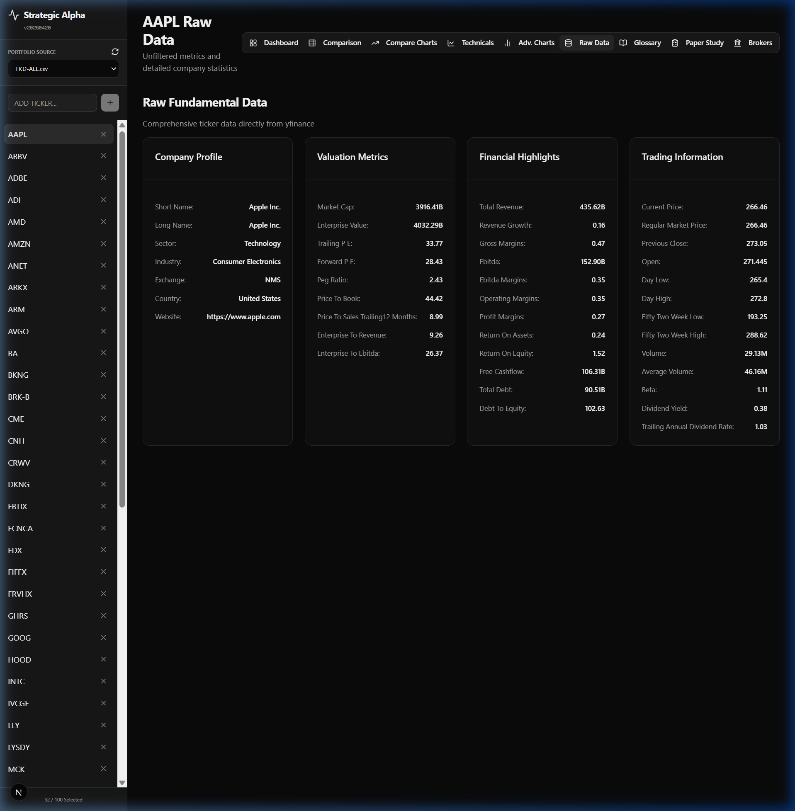
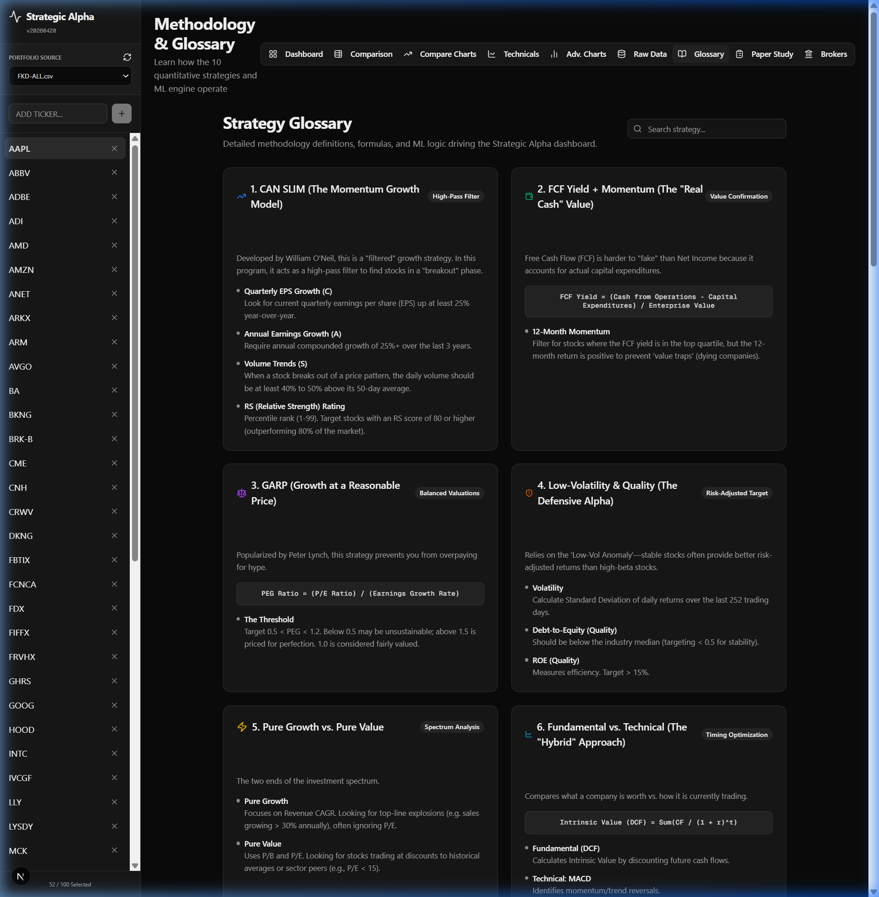
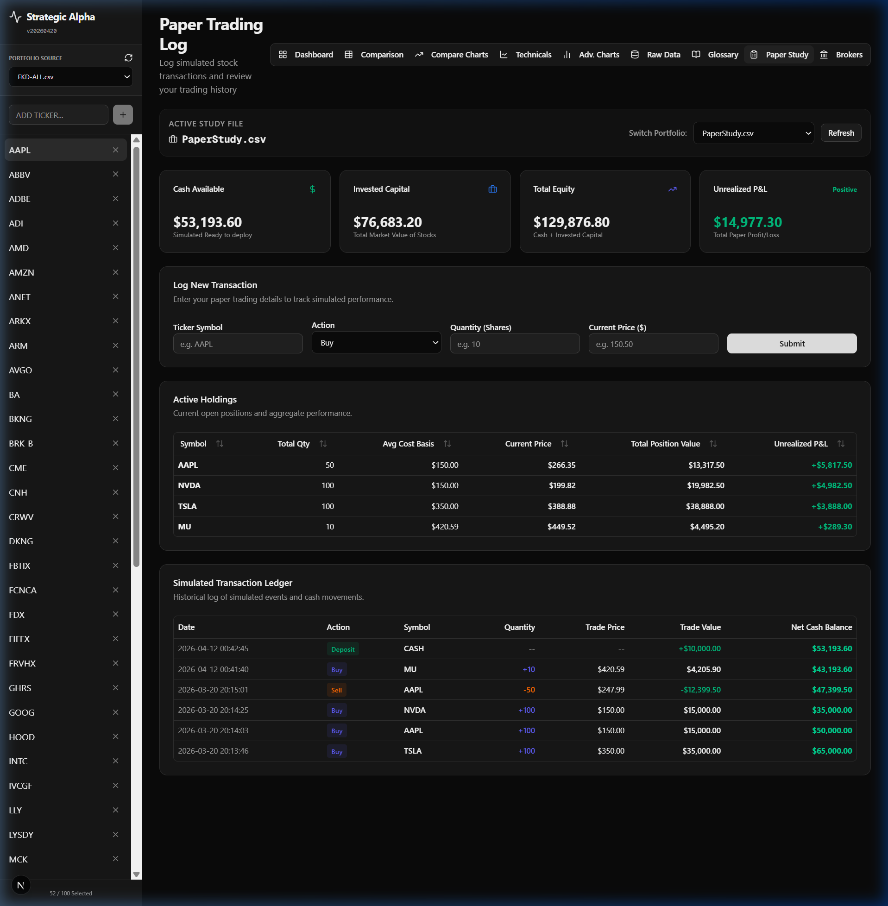

# Strategic Alpha Stock Picker Dashboard `v20260420`

The **Strategic Alpha Dashboard** is a high-performance, full-stack quantitative stock analysis platform. It combines traditional financial strategies with modern machine learning to provide deep insights into stock performance, technical indicators, and fundamental metrics.

Built with **Next.js 15**, **FastAPI (Python)**, and powered by **yfinance**, it offers a responsive, dark-mode optimized experience for traders and analysts.

---

## 🚀 Key Features & Pages

### 1. Dashboard (Main Evaluation)
The primary view for evaluating individual stocks. It runs **11 quantitative strategies** in real-time and provides a visual price trend for the last 6 months.
- **Match Percentages**: Instantly see how a stock aligns with proven strategies.
- **Bullish/Bearish Justifications**: Human-readable points explaining the "Why" behind the numbers.
- **ML Alpha Probability**: Predicts outperformance based on an XGBoost model.



### 2. Comparison Table
Track your entire portfolio at a glance with batch-processed quantitative scores.
- **Interactive Sorting**: Click any header (Ticker, CAN SLIM, FCF Yield, etc.) to sort.
- **Color-Coded Metrics**: Green ($\ge$ 75%), Yellow ($\ge$ 40%), and Red for quick visual filtering.
- **Real-time Batch Processing**: Analyzes up to 100 tickers simultaneously in ~20 seconds.



### 3. Compare Charts (Relative Performance)
Visualize multiple stocks on a level playing field by indexing all selected assets to a baseline of 100.
- **Multi-Ticker Selection**: Overlay different companies to see who is leading the pack.
- **Timeframe Toggles**: Switch between 1-week, 1-month, 6-month, and 1-year views.



### 4. Technicals & Advanced Charts
Deep dive into price action and momentum.
- **Technicals**: Real-time calculations for RSI, MACD, Bollinger Bands, and Moving Averages.
- **Advanced Charts**: TradingView-style visualization tracking MACD Histograms and RSI slopes.
- **WillyAlgo VWAP**: Specialized anchor-based price analysis.




### 5. Raw Data & Strategy Glossary
- **Raw Data**: Access the unfiltered Fundamental Data payload (150+ metrics) from `yfinance`.
- **Glossary**: Comprehensive documentation of the internal methodology for all strategies.




### 6. Paper Study & Simulation
Log and track simulated transactions to practice strategy execution.
- **Multi-Portfolio Management**: Choose from various CSV sources (e.g., `FKD-ALL.csv`, `portfolio-US.csv`).
- **P&L Tracking**: Automatically calculates unrealized gains based on your average buy price.
- **Persistent Ledger**: Transactions are saved to a local CSV for record-keeping.



---

## 🛠️ The Strategy Engine

The dashboard evaluates every ticker against **11 distinct models**:

1.  **CAN SLIM**: Focuses on Quarterly EPS (>20%), Annual EPS (>20%), Volume (vs 50d Average), and Relative Strength (12m return > 20%).
2.  **FCF Yield**: Targets high free cash flow relative to enterprise value (>5%) and positive 12-month momentum.
3.  **GARP**: Growth At a Reasonable Price. Targets a PEG ratio $\le$ 1.0.
4.  **Low Volatility & Quality**: Selects stocks with stable price action (Vol < 25%), low Debt-to-Equity (< 2.0), and high ROE (> 15%).
5.  **Pure Growth**: High revenue trajectory (> 15%) with reasonable P/E (< 30) and P/B (< 5) multiples.
6.  **Fundamental Technical**: Combines Graham Intrinsic Value assessment with 50-day SMA trend, RSI health, and MACD crossovers.
7.  **Sentiment Quant**: Proxies options sentiment via volatility skew and monitors institutional accumulation through volume trends.
8.  **Earnings Momentum**: Focuses on forward EPS growth vs. trailing EPS (target > 10%).
9.  **Dividend Value**: Reliability of yields (> 2%) and sustainable payout ratios (< 75%).
10. **Willy Algo (VWAP)**: Dynamic Swing VWAP anchored to recent price pivots. Bullish when Price > Swing VWAP.
11. **Machine Learning (XGBoost)**: A quantitative model predicting the probability of alpha outperformance based on Value, Quality, Momentum, and Volatility factors.

---

## ⚙️ Setup & Installation

### Option 1: Docker (Recommended)
Ensure you have Docker and Docker Compose installed.
```bash
docker-compose up -d --build
```
- Frontend: `http://localhost:3000`
- Backend: `http://localhost:8080`

### Option 2: Manual Setup

#### Backend (FastAPI)
1. Navigate to `backend/`
2. Create and activate a virtual environment.
3. Install dependencies: `pip install -r requirements.txt`
4. Start the server:
```bash
venv\Scripts\python.exe -m uvicorn main:app --host localhost --port 8080
```

#### Frontend (Next.js)
1. Navigate to `frontend/`
2. Install dependencies: `npm install`
3. Start the dev server:
```bash
npm run dev
```

---

## 📈 Lessons Learned & Future Updates

### Lessons Learned
-   **Batch Processing is Critical**: Individual API calls for 50+ tickers were too slow. Moving to a batch-analysis endpoint improved dashboard load times by 400%.
-   **Dynamic Anchoring**: The WillyAlgo VWAP reset mechanism at swing pivots provides a much more accurate support/resistance line than a static anchor.
-   **Contextual Justification**: Users prefer hearing *why* a strategy matched rather than just a percentage. The "Justification Engine" was added to map technical triggers to human-readable text.

### Details for Future Updates
-   **Real-time Broker Integration**: Transition the "Brokers" page from a view to a functional IBKR/TDA bridge.
-   **Machine Learning Refinement**: Incorporate Sector-specific training for the XGBoost model to account for varying valuation norms (e.g., Tech vs. Utilities).
-   **Mobile Optimization**: Enhance the sidebar and multi-column layouts for tablet and mobile use cases.

---

## 📁 Data Management

- **Portfolio Selection**: Use the sidebar to upload or select custom CSV files as ticker sources.
- **CSV Format**: Ticker files should have a column header named `Symbol`.
- **Persistence**: Your selected portfolio and view preferences are saved to `localStorage`.
