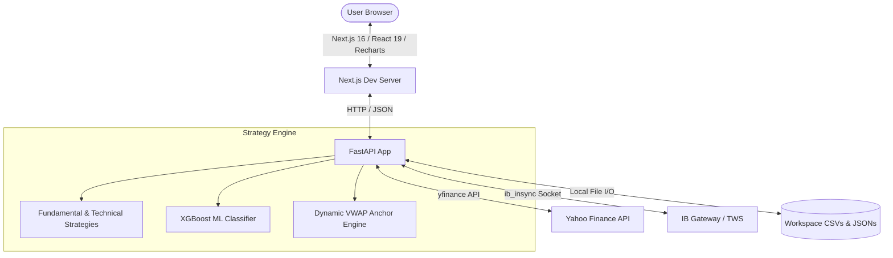
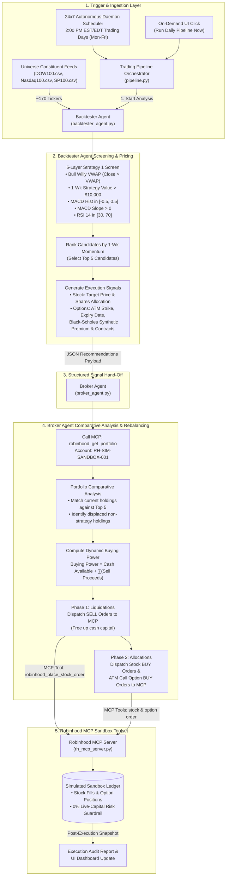

# Strategic Alpha Stock Picker Dashboard Documentation

The **Strategic Alpha Dashboard** is an institutional-grade, full-stack quantitative stock analysis platform. It integrates modern machine learning models, classical momentum indicators, and financial strategy models to evaluate equity tickers, backtest custom trading rules, simulate paper trading, and interface directly with broker gateways.

---

## 📋 1. Core Requirements

The application is engineered to meet the following functional and non-functional requirements:

### A. Real-Time Single-Ticker Evaluation
*   **11 Quantitative Strategy Models**: Calculate eligibility scores in real-time across 11 distinct investment methodologies (GARP, Pure Growth, CAN SLIM, Dividend Value, etc.).
*   **Justification Engine**: Dynamically synthesize human-readable explanations behind indicator calculations to provide transparent "Why" insights behind strategy matches.
*   **Machine Learning Integration**: Feed normalized ticker metrics into an XGBoost classifier model to output the probability of Alpha outperformance.
*   **Trend Visualization**: Render responsive 6-month historical price charts with overlays for technical review.

### B. Macroscopic Comparison & Backtesting
*   **Multi-Ticker Table**: Row-by-row visual comparison of all favorite or loaded tickers.
*   **Dynamic Sorting**: Sort tables on any strategy or ML score to easily rank assets.
*   **Willy VWAP Backtesting Engine**: Compute and compare the performance of the self-anchoring Willy VWAP strategy versus a passive "Buy & Hold" approach over a dynamic 4-month rolling window with initial capital of $10,000.
*   **Transaction Ledgers**: Generate a detailed chronological trade log for each backtest, tracking dates, actions (BUY/SELL), execution prices, shares, cash, and running portfolio values.

### C. Multi-Asset Compare Charts
*   **Normalized Baseline**: Chart multiple tickers on a relative performance index starting at a baseline of 100, enabling "apples-to-apples" comparison over multiple timeframes (1M, 3M, 6M, 1Y, 5Y).

### D. Technical Indicators & Advanced Charting
*   **Indicators Panel**: Display real-time computations of support/resistance bands, SMAs (9, 50, 200), EMA (20), RSI (14) with slopes, Bollinger Bands, and MACD.
*   **Automated Chart Capturing**: Standardize screenshot formatting using Playwright/Puppeteer with a 90% viewport scaling zoom factor to ensure no axis indicators or bottom oscillators are cropped.

### E. Paper Study & Simulation
*   **Multi-Portfolio Support**: Load custom CSV files from the workspace as active portfolios, with `localStorage` persistence.
*   **Real-Time Price Autofill**: Query `yfinance` to automatically populate current market prices on ticker input.
*   **Simulated Ledger**: Write transaction records (Date, Ticker, Quantity, Price, Total Cost, Running Cash) to persistent workspace CSV files while tracking real-time unrealized P&L.

### F. Broker Integration
*   **Interactive Brokers Gateway**: Securely connect to a local IB Gateway or TWS session using `ib_insync` to monitor account equity, cash balances, open orders, and active positions in a unified interface.

### G. Benchmark Index Comparative Analysis (Top Tickers)
*   **Index Multi-Select Support**: Load and compare constituents of major benchmark indices (`DOW100.csv` / Dow 30, `Nasdaq100.csv` / Nasdaq 100, and `SP100.csv` / S&P 500) using a multi-select toggle layout.
*   **Set Union Merging**: Add/remove index selections dynamically, automatically performing a set union of all tickers across the selected indices.
*   **Safe Chunked Loading**: Fetch analysis data in small, background-loaded consecutive chunks of 10 tickers to avoid Yahoo Finance query timeouts.
*   **Quantitative Screener**: Execute a 5-layer screen filtering matching symbols (Willy Market = Bull, 1-mo backtest strategy value > $10,000, MACD Hist within ±0.5, MACD Slope > 0, and RSI between 30 and 70) and save candidates to `Top_Tickers_to_buy.csv` in the project root.

---

## 🎨 2. Design Factors & Aesthetics

The design of the application prioritizes visual excellence and ergonomic efficiency:

*   **Aesthetic Glassmorphism UI**: Uses a premium, dark-mode optimized color palette. Cards and widgets feature translucent backgrounds with thin borders, backdrop blurs, and neon accents to resemble a modern trading desk terminal.
*   **Color-Coded Feedback**: Match percentages are styled dynamically—Green for strong matches ($\ge$ 75%), Yellow for moderate matches (40-74%), and Red for weak matches (< 40%)—ensuring readability.
*   **Sticky Ticker Column**: Lock target stock identifiers to the left edge of comparison grids to maintain context when scrolling horizontally through complex data sets.
*   **Performance Optimization**: Utilizes parallel API requests, history caching, and batch query endpoints to keep UI rendering latency below 700ms.

---

## 🏛️ 3. General Design & Architecture



### A. Dynamic Self-Anchoring VWAP (WillyAlgo)
Unlike a standard daily-reset VWAP, the **WillyAlgo** dynamically detects market structure changes using a swing pivot detection algorithm (configured with a default 5-bar window). The moment a significant swing high or low is reached, the VWAP anchors reset to 0, tracking volume fair value from the pivot forward.

### B. Viewport Scaling Optimization
For automated portfolio reports, a dedicated script uses Chromium to capture technical charts. The viewport is styled with a `90%` zoom factor to ensure all bottom indicators, MACD labels, and legends are captured without cropping.

---

## 💻 4. Implementation Details

### A. Technical Stack
*   **Backend**: Python, FastAPI, Uvicorn, `yfinance` (Data Fetcher), `xgboost` & `scikit-learn` (Predictive Models), `ib_insync` (IBKR Bridge).
*   **Frontend**: Next.js 16, React 19, TypeScript, Recharts (Responsive Charting), Tailwind CSS (Glassmorphism design system).
*   **Dev-Ops/Execution**: Python Virtual Environment (`.venv`), Node Package Manager (Webpack bundler mode to ensure compatibility with Node v24).

### B. Core File Structure
*   [`backend/main.py`](file:///c:/Users/moder/AntiGravity/StockPickerStrategies-20260610/backend/main.py): Primary REST API containing endpoints for analysis, backtests, raw data, paper simulation, reports, and IB configuration.
*   [`backend/models.py`](file:///c:/Users/moder/AntiGravity/StockPickerStrategies-20260610/backend/models.py): Pydantic schema schemas mapping the data structures.
*   [`backend/strategies/`](file:///c:/Users/moder/AntiGravity/StockPickerStrategies-20260610/backend/strategies): Python modules evaluating individual strategy parameters (e.g., `can_slim.py`, `willy_algo.py`, `machine_learning.py`).
*   [`backend/services/strategy_engine.py`](file:///c:/Users/moder/AntiGravity/StockPickerStrategies-20260610/backend/services/strategy_engine.py): Main coordinator running the ticker metrics through all strategy models.
*   [`frontend/src/components/`](file:///c:/Users/moder/AntiGravity/StockPickerStrategies-20260610/frontend/src/components): React widgets (e.g., `AnalysisPanel.tsx`, `BacktestDetails.tsx`).

---

## 🚀 5. How to Use the Application

### A. Local Setup & Execution

#### 1. Start the Backend (FastAPI)
Navigate to the `backend/` directory, activate the Python virtual environment, and boot the server using Uvicorn:
```bash
cd backend
.venv\Scripts\activate
python -m uvicorn main:app --host localhost --port 8080
```
Verify the server status by visiting [http://localhost:8080/health](http://localhost:8080/health) (should return `{"status":"ok"}`).

#### 2. Start the Frontend (Next.js)
Navigate to the `frontend/` directory and boot the development server in Webpack mode:
```bash
cd frontend
npx next dev --webpack
```
Open [http://localhost:3000](http://localhost:3000) in your web browser.

---

### B. Interface Guide & Features

#### 1. Single Ticker Dashboard
*   **Action**: Enter a stock ticker (e.g., `AAPL`, `NVDA`) in the search bar and press enter.
*   **Insight**: The interface displays a 6-month historical trend line alongside the **Quant Factors Breakdown** panel showing dynamic percentages and justification cards. The **ML Alpha Probability** panel reports the predicted likelihood of outperforming the benchmark.


#### 2. Portfolio Comparison & Backtesting
*   **Action**: Toggle to the *Comparison* tab to view the list of tracked tickers. Click on columns to sort them.
*   **Willy VWAP Backtest**: Select any ticker in the table to open the detailed backtest drawer. It simulates the self-anchored Willy VWAP trading rule over a rolling 4-month window, plotting the equity curve (Strategy vs. Buy & Hold) and generating a full transaction ledger.


#### 3. Relative Performance (Compare Charts)
*   **Action**: Click the *Compare Charts* tab.
*   **Insight**: Select multiple tickers to view their indexed performance. All selected stocks start at a baseline of `100` at the beginning of the timeframe, letting you compare percentage growth directly.


#### 4. Technical Indicators
*   **Action**: Open the *Technical Indicators* tab.
*   **Insight**: Inspect short and long-term Moving Averages (9, 50, 200), Bollinger Bands, RSI momentum curves, and MACD histograms.


#### 5. Advanced Charts
*   **Action**: Access the *Advanced Charts* screen.
*   **Insight**: View high-resolution TradingView-style charts. This view is optimized for Playwright captures, rendering bottom oscillators perfectly at a 90% zoom ratio.


#### 6. Raw Data Exploration
*   **Action**: Select the *Raw Data* tab.
*   **Insight**: Explore the raw financial payload (150+ metrics) directly parsed from `yfinance`, categorized by valuation, profile, trading, and balance sheet metrics.


#### 7. Strategy Glossary
*   **Action**: Open the *Glossary* tab.
*   **Insight**: View the mathematical references, formulas, and metric boundaries for every strategy in the engine, including the exact hyperparameters of the XGBoost classifier.


#### 8. Paper Study Simulation
*   **Action**: Toggle to the *Paper Study* page.
*   **Insight**: Run paper transactions. Enter a ticker to auto-fill its current price, select transaction type (Buy, Sell, Deposit, Withdraw), and input quantities. The local ledger updates instantly, displaying current cash, active holdings, and unrealized profit.


#### 9. Broker Gateway
*   **Action**: Select the *Brokers* tab.
*   **Insight**: Log in with your Interactive Brokers gateway credentials. The screen retrieves your real-time buying power, net liquidation value, active orders, and live positions from TWS/IB Gateway.


#### 10. Top Tickers Analysis & Buy Screener
*   **Action**: Select the *Top Tickers* tab. Click to toggle selection for **Dow 30**, **Nasdaq 100**, and **S&P 500**.
*   **Screener Action**: Click the **Run Buy Screen** button. View the list of matching candidates in the glassmorphic container, then click **Save to Top_Tickers_to_buy.csv** to output the buy list to the workspace.


#### 11. Options Backtesting Engine & P&L Analytics
*   **Action**: In the *Top Tickers* tab, locate the **Options Strategy Row**.
*   **Configuration**:
    *   Select your lookback timeframe (**1W**, **1M**, **3M**, **6M**, **1Y**).
    *   Choose an **Options Exit Strategy**:
        *   **T+2, T+3, T+5, T+7, T+10, T+12, T+14, T+21 Intraday**: Exits positions at 11:00 AM NY time with synthetic Black-Scholes re-pricing based on remaining DTE.
        *   **Hold to Expiry**: Holds positions to weekly expiration (~7 calendar days) and settles at intrinsic value $\max(S_{exit} - K, 0)$.
*   **Execution & Pricing**:
    *   Screens top 5 candidates daily via Strategy 1 (Willy Bull, 1-Wk Value > $10k, MACD Hist, MACD Slope > 0, RSI 30-70).
    *   Simulates buying At-The-Money (ATM) Calls at T+1 3:00 PM priced via Black-Scholes with 30-day realized volatility and 5% risk-free rate.
    *   Positions sized with $2,000 per ticker ($10,000 maximum daily allocation).
*   **Analyzing Results**:
    *   **Options P&L ($ & %)**: Total dollar profit and ROI across the period.
    *   **Hold to Expiry Baseline**: Measures passive holding vs. active intraday exit profit capture.
    *   **Relative Performance Denominator**: $\frac{\text{Strategy P\&L} - \text{Hold P\&L}}{|\text{Hold P\&L}|} \times 100\%$ isolates the exact alpha generated by exit timing.
    *   **S&P 500 Benchmark**: Quantifies excess leveraged alpha over the broad market.
    *   **Options Trade Ledger**: Inspect per-contract strikes, entry/exit premiums, leverage multiples, and export full logs to `Backtest_Ledger_Options.csv`.

#### 12. Specialized AI Agents & Robinhood MCP Sandbox Pipeline
*   **Action**: Select the *Brokers* tab and choose **Robinhood Agentic AI**.
*   **Dual Agent Architecture**:
    *   **1. Backtester Agent**:
        *   **Automated 24x7 In-Process Schedule**: Daemon background scheduler thread monitoring `America/New_York` market time continuously in Docker, automatically triggering every trading day at **2:00 PM Market Time (EST/EDT)**.
        *   **Universe Scan**: Scans all ~170 constituent tickers from the **Dow 30**, **Nasdaq 100**, and **S&P 500**.
        *   **Quantitative Screener**: Runs Strategy 1 (1-Week lookback) with 5 strict filters (Willy Bull state, 1-Wk Strategy Value > $10k, MACD Hist $\in (-0.5, 0.5)$, MACD Slope $> 0$, RSI $14 \in (30, 70)$).
        *   **Signals Generated**: Produces target stock share allocations and ATM Call options parameters (strike, weekly expiration, synthetic Black-Scholes premium).
    *   **2. Broker Agent**:
        *   **Portfolio Comparative Analysis**: Queries the active Robinhood Sandbox account (`RH-SIM-SANDBOX-001`) and compares current holdings against incoming recommendations.
        *   **Dynamic Liquidation & Buying Power**: Automatically generates SELL orders for non-strategy positions to free up cash. Computes effective buying power as:
            $$\text{Effective Buying Power} = \text{Available Cash} + \sum \text{Sell Liquidation Proceeds}$$
        *   **Order Execution**: Sizes and dispatches simulated BUY limit orders for top stocks and ATM Call option contracts directly via the Robinhood Model Context Protocol (MCP) toolset.
*   **Guardrails**: All operations are restricted to the sandbox simulation environment, ensuring 0% live-capital risk.
*   **Interactive Controls**: Click **Run Daily Pipeline Now** to trigger on-demand linear analysis, view real-time stage execution breakdowns, and inspect the Robinhood MCP sandbox order ledger.



#### 13. Call Option Stats Matrix & Trend Metrics
*   **Action**: Click the **Call Option Stats Matrix** button on the Top Tickers view or open the modal.
*   **Multi-Period Ordinary Least Squares (OLS) Linear Fit**:
    *   Configurable timeframes (`1Wk`, `2Wk`, `4Wk`, `6Wk`, `3 months`, `6 months`) dynamically calculating linear slope ($m$) and residual standard deviation ($\text{Std}$).
*   **Normalized Trend Metrics**:
    *   **Slope %**: $\text{Slope \%} = \frac{\text{Slope}}{\text{Price}} \times 100\%$ — Normalized percentage drift rate per day.
    *   **Std %**: $\text{Std \%} = \frac{\text{Std Dev}}{\text{Price}} \times 100\%$ — Normalized percentage price volatility envelope.
    *   **Trend Score**: $\text{Trend} = \frac{\text{Slope \%}}{\text{Std \%}}$ — Quantifies the signal-to-noise ratio of directional momentum, highlighting clean trend breakouts suitable for Call Option entries.

#### 14. Slope % Ranked Call Options Backtesting Engine (1-Week & 2-Day Holding)
*   **Action**: On the Top Tickers panel, select the **Slope % (1-Week Hold)** or **Slope % (2-Day Hold)** Backtest tabs.
*   **Core Mechanics**:
    *   **Screening**: Filters constituents across Dow 30, Nasdaq 100, and S&P 500 on Day $T$ for positive Slope % ($m > 0$), RSI, MACD, and Volume health.
    *   **Candidate Ranking**: Ranks eligible tickers by descending Slope % over the selected OLS lookback window (`1Wk`, `2Wk`, `4Wk`, `6Wk`, `3M`, `6M`).
    *   **Execution Models**:
        *   **1-Week Hold**: Enters 1-Month ATM Call options on Day $T+1$ (Open) and exits 1 week later (Day $T+5$ Close).
        *   **2-Day Hold**: Enters 1-Month ATM Call options on Day $T+1$ (Open) and exits 2 trading days later (Day $T+3$ Close) to capture immediate breakout momentum.
    *   **Ledger & Analytics**: Displays day-by-day strike, expiration, premium leverage multiple, Slope %, Std %, and Trend score metrics with Dow, S&P 500, and NASDAQ benchmark comparisons.


