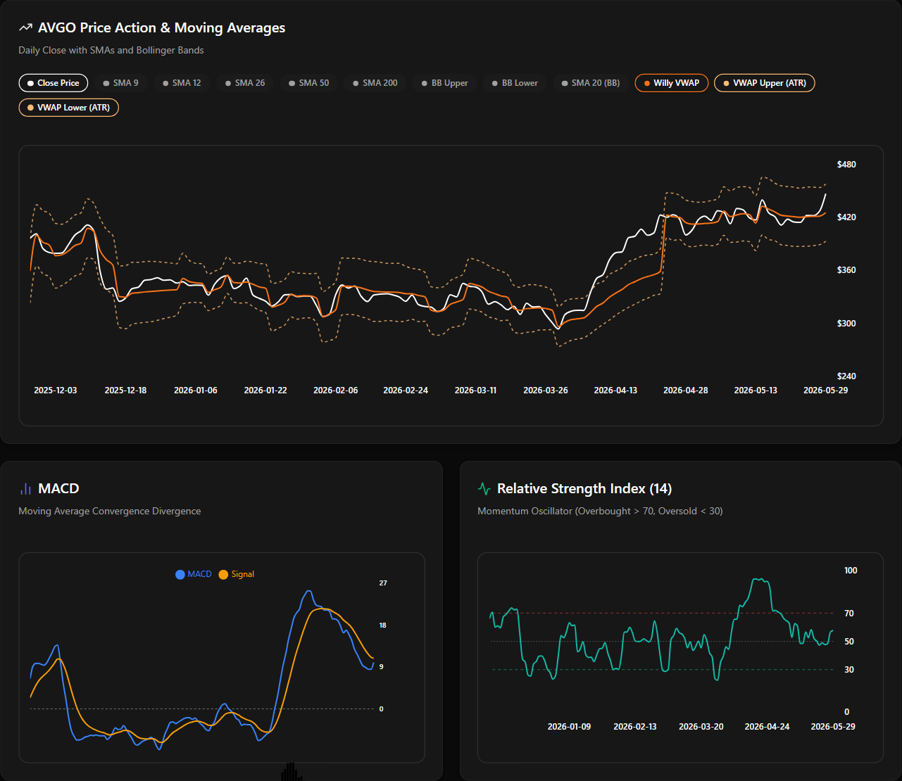
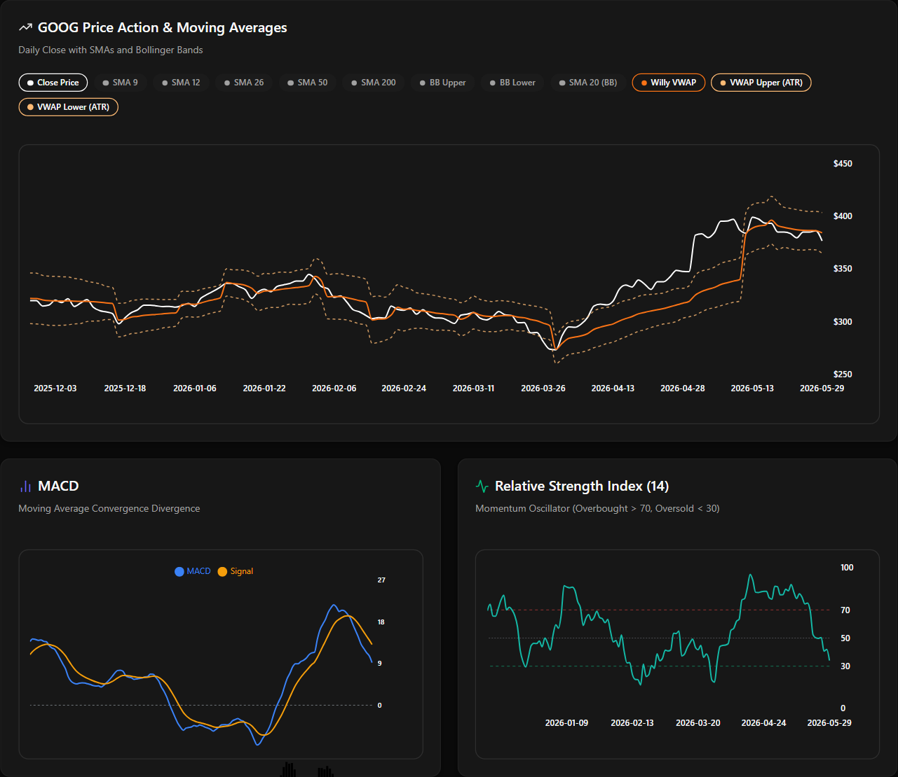
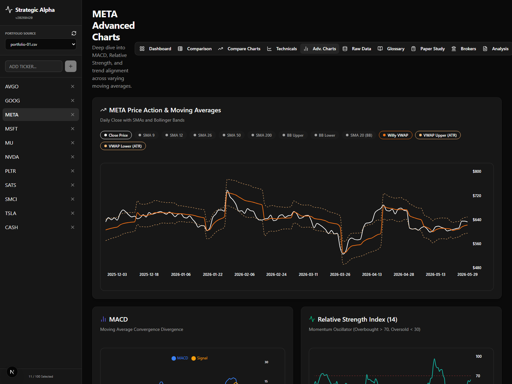
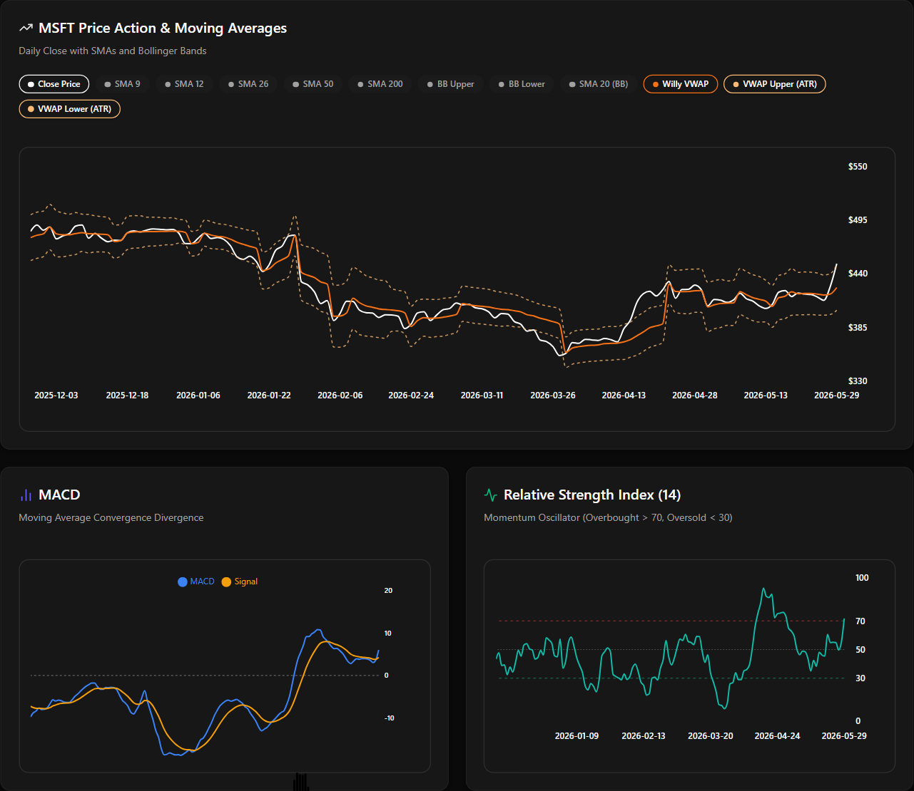
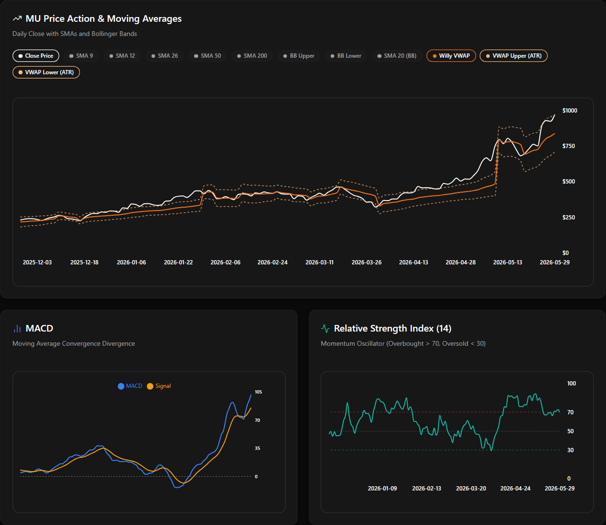
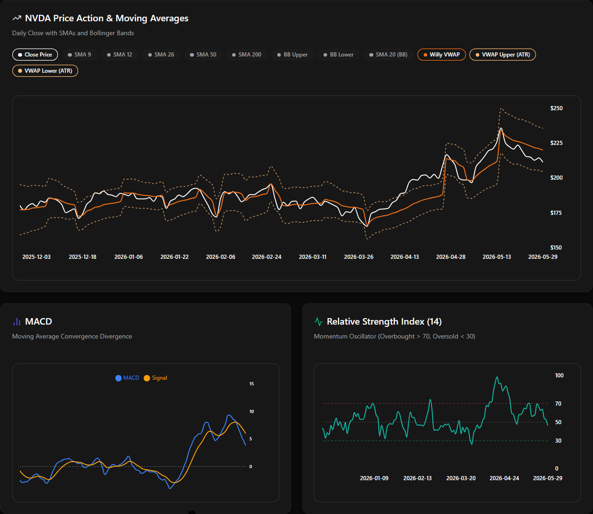
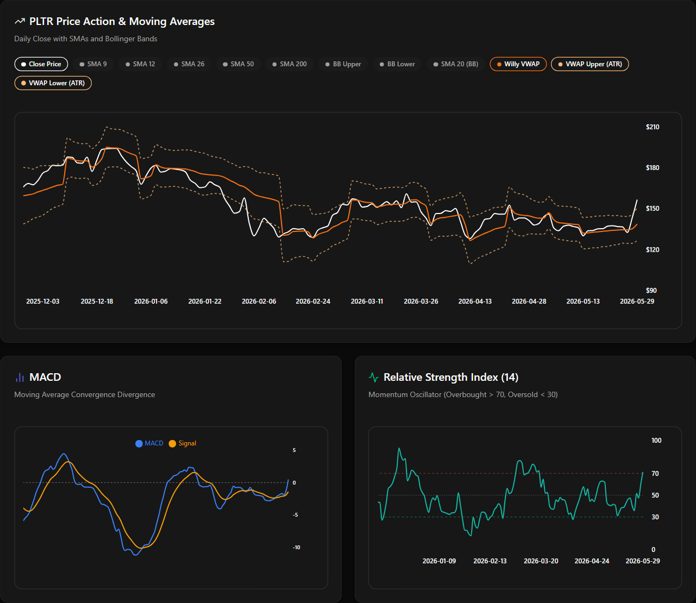
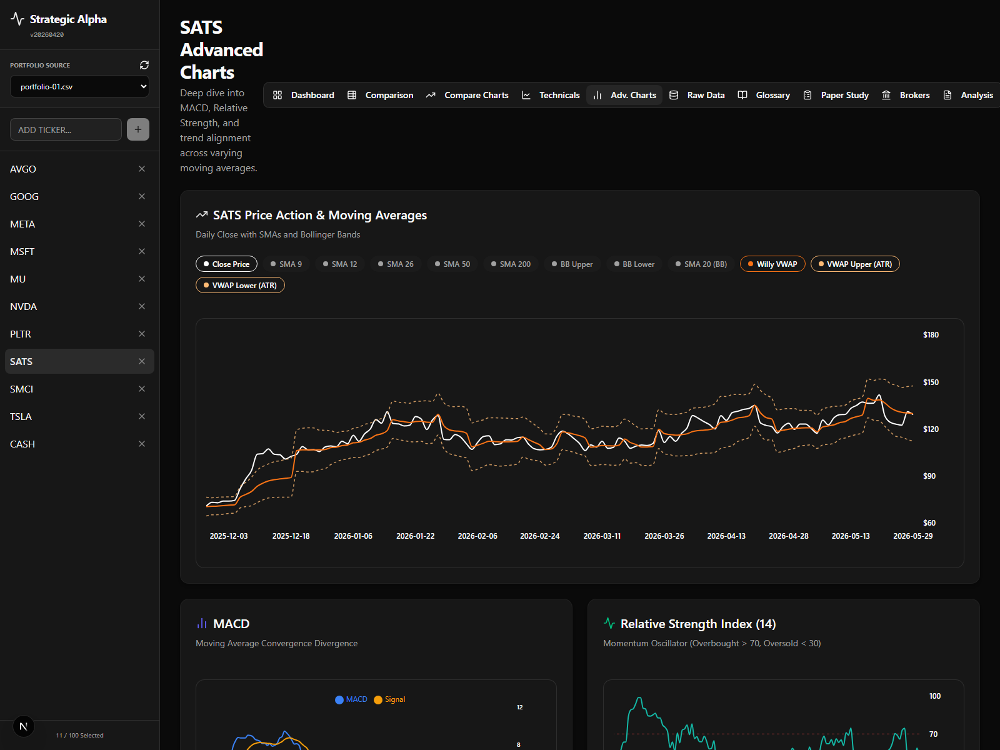
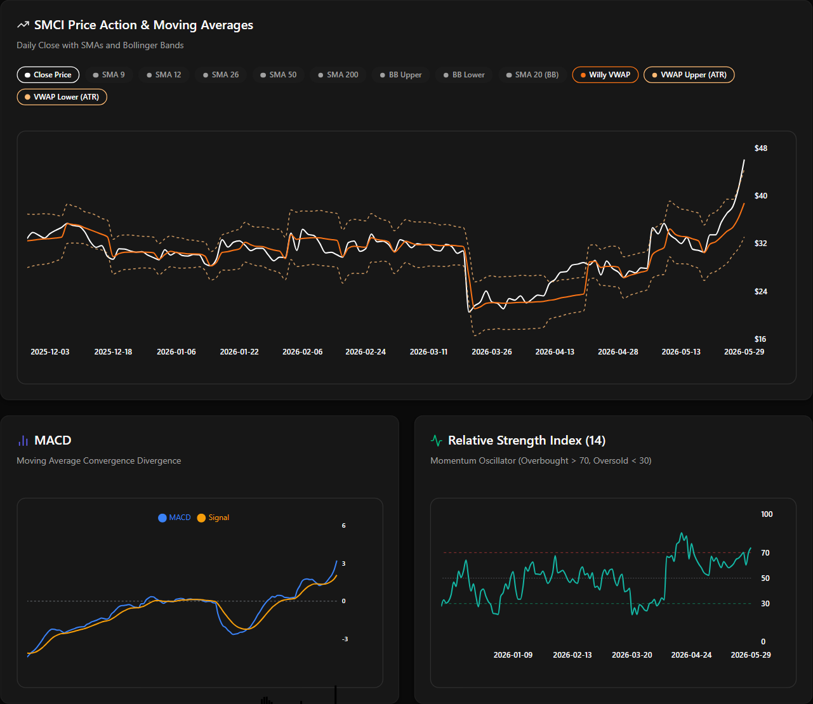
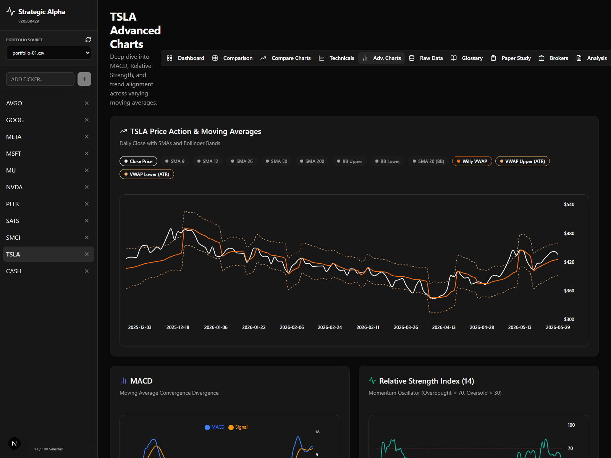

# Strategic Alpha Portfolio Analysis Report

- **Generated:** 2026-05-30 17:58:14
- **Source Portfolio:** `Portfolio_Positions_May-29-2026 - 4223.csv`

## Executive Summary

- **Total Tickers Analyzed:** 10
- **BUY / ACCUMULATE Recommendations:** 3
- **SELL / TAKE PROFITS Recommendations:** 4
- **HOLD / WATCH Recommendations:** 3

## Action Matrix Table

| Ticker | Current Price ($) | Willy VWAP Support ($) | ATR Lower Support ($) | ATR Upper Resistance ($) | Posture | Recommendation |
| :--- | :---: | :---: | :---: | :---: | :--- | :--- |
| **AVGO** | 446.77 | 425.16 | 392.80 | 457.53 | Bullish Swing (Mid-channel) | **HOLD** |
| **GOOG** | 376.43 | 384.08 | 364.80 | 403.37 | Bearish Swing (Retraction Zone) | **HOLD / WATCH FOR BUY** |
| **META** | 632.51 | 622.09 | 595.09 | 649.08 | Bullish Swing (Mid-channel) | **HOLD** |
| **MSFT** | 450.24 | 425.74 | 402.41 | 449.07 | Overbought (Above Upper ATR) | **SELL / TAKE PROFITS** |
| **MU** | 971.00 | 838.41 | 708.60 | 968.23 | Overbought (Above Upper ATR) | **SELL / TAKE PROFITS** |
| **NVDA** | 211.14 | 219.88 | 204.27 | 235.50 | Bearish Swing (Retraction Zone) | **HOLD / WATCH FOR BUY** |
| **PLTR** | 156.54 | 138.68 | 126.67 | 150.68 | Overbought (Above Upper ATR) | **SELL / TAKE PROFITS** |
| **SATS** | 129.19 | 129.84 | 112.23 | 147.46 | Bearish Swing (Retraction Zone) | **HOLD / WATCH FOR BUY** |
| **SMCI** | 46.09 | 38.78 | 33.11 | 44.46 | Overbought (Above Upper ATR) | **SELL / TAKE PROFITS** |
| **TSLA** | 435.79 | 425.39 | 392.48 | 458.30 | Bullish Swing (Mid-channel) | **HOLD** |

## Detailed Technical Justifications

### AVGO - HOLD

- **Current Close Price:** $446.77
- **Willy VWAP Dynamic Support:** $425.16
- **ATR Boundary Envelope:** $392.80 (Lower Support) to $457.53 (Upper Resistance)
- **Technical Posture:** Bullish Swing (Mid-channel)

#### Justification Bulletins:
- Price ($446.77) is in an orderly upward trend above the Willy VWAP Dynamic Anchor ($425.16).
- Upward momentum is intact. The nearest resistance target sits at the upper ATR line ($457.53).
- Maintain current swing long postures.

#### Technical Analysis Chart

---

### GOOG - HOLD / WATCH FOR BUY

- **Current Close Price:** $376.43
- **Willy VWAP Dynamic Support:** $384.08
- **ATR Boundary Envelope:** $364.80 (Lower Support) to $403.37 (Upper Resistance)
- **Technical Posture:** Bearish Swing (Retraction Zone)

#### Justification Bulletins:
- Price ($376.43) is retracing in a bearish short-term swing below the Willy VWAP pivot ($384.08).
- Approaching the lower ATR support envelope at $364.80.
- Hold current shares but watch for a volume-supported bounce near the support boundary to add exposure.

#### Technical Analysis Chart

---

### META - HOLD

- **Current Close Price:** $632.51
- **Willy VWAP Dynamic Support:** $622.09
- **ATR Boundary Envelope:** $595.09 (Lower Support) to $649.08 (Upper Resistance)
- **Technical Posture:** Bullish Swing (Mid-channel)

#### Justification Bulletins:
- Price ($632.51) is in an orderly upward trend above the Willy VWAP Dynamic Anchor ($622.09).
- Upward momentum is intact. The nearest resistance target sits at the upper ATR line ($649.08).
- Maintain current swing long postures.

#### Technical Analysis Chart

---

### MSFT - SELL / TAKE PROFITS

- **Current Close Price:** $450.24
- **Willy VWAP Dynamic Support:** $425.74
- **ATR Boundary Envelope:** $402.41 (Lower Support) to $449.07 (Upper Resistance)
- **Technical Posture:** Overbought (Above Upper ATR)

#### Justification Bulletins:
- Price ($450.24) has broken above the 2.0 ATR Upper Band ($449.07).
- This signifies an extremely overextended bullish swing with high probability of near-term mean reversion.
- Willy VWAP Dynamic Support sits at $425.74. Recommend locking in gains.

#### Technical Analysis Chart

---

### MU - SELL / TAKE PROFITS

- **Current Close Price:** $971.00
- **Willy VWAP Dynamic Support:** $838.41
- **ATR Boundary Envelope:** $708.60 (Lower Support) to $968.23 (Upper Resistance)
- **Technical Posture:** Overbought (Above Upper ATR)

#### Justification Bulletins:
- Price ($971.00) has broken above the 2.0 ATR Upper Band ($968.23).
- This signifies an extremely overextended bullish swing with high probability of near-term mean reversion.
- Willy VWAP Dynamic Support sits at $838.41. Recommend locking in gains.

#### Technical Analysis Chart

---

### NVDA - HOLD / WATCH FOR BUY

- **Current Close Price:** $211.14
- **Willy VWAP Dynamic Support:** $219.88
- **ATR Boundary Envelope:** $204.27 (Lower Support) to $235.50 (Upper Resistance)
- **Technical Posture:** Bearish Swing (Retraction Zone)

#### Justification Bulletins:
- Price ($211.14) is retracing in a bearish short-term swing below the Willy VWAP pivot ($219.88).
- Approaching the lower ATR support envelope at $204.27.
- Hold current shares but watch for a volume-supported bounce near the support boundary to add exposure.

#### Technical Analysis Chart

---

### PLTR - SELL / TAKE PROFITS

- **Current Close Price:** $156.54
- **Willy VWAP Dynamic Support:** $138.68
- **ATR Boundary Envelope:** $126.67 (Lower Support) to $150.68 (Upper Resistance)
- **Technical Posture:** Overbought (Above Upper ATR)

#### Justification Bulletins:
- Price ($156.54) has broken above the 2.0 ATR Upper Band ($150.68).
- This signifies an extremely overextended bullish swing with high probability of near-term mean reversion.
- Willy VWAP Dynamic Support sits at $138.68. Recommend locking in gains.

#### Technical Analysis Chart

---

### SATS - HOLD / WATCH FOR BUY

- **Current Close Price:** $129.19
- **Willy VWAP Dynamic Support:** $129.84
- **ATR Boundary Envelope:** $112.23 (Lower Support) to $147.46 (Upper Resistance)
- **Technical Posture:** Bearish Swing (Retraction Zone)

#### Justification Bulletins:
- Price ($129.19) is retracing in a bearish short-term swing below the Willy VWAP pivot ($129.84).
- Approaching the lower ATR support envelope at $112.23.
- Hold current shares but watch for a volume-supported bounce near the support boundary to add exposure.

#### Technical Analysis Chart

---

### SMCI - SELL / TAKE PROFITS

- **Current Close Price:** $46.09
- **Willy VWAP Dynamic Support:** $38.78
- **ATR Boundary Envelope:** $33.11 (Lower Support) to $44.46 (Upper Resistance)
- **Technical Posture:** Overbought (Above Upper ATR)

#### Justification Bulletins:
- Price ($46.09) has broken above the 2.0 ATR Upper Band ($44.46).
- This signifies an extremely overextended bullish swing with high probability of near-term mean reversion.
- Willy VWAP Dynamic Support sits at $38.78. Recommend locking in gains.

#### Technical Analysis Chart

---

### TSLA - HOLD

- **Current Close Price:** $435.79
- **Willy VWAP Dynamic Support:** $425.39
- **ATR Boundary Envelope:** $392.48 (Lower Support) to $458.30 (Upper Resistance)
- **Technical Posture:** Bullish Swing (Mid-channel)

#### Justification Bulletins:
- Price ($435.79) is in an orderly upward trend above the Willy VWAP Dynamic Anchor ($425.39).
- Upward momentum is intact. The nearest resistance target sits at the upper ATR line ($458.30).
- Maintain current swing long postures.

#### Technical Analysis Chart

---
