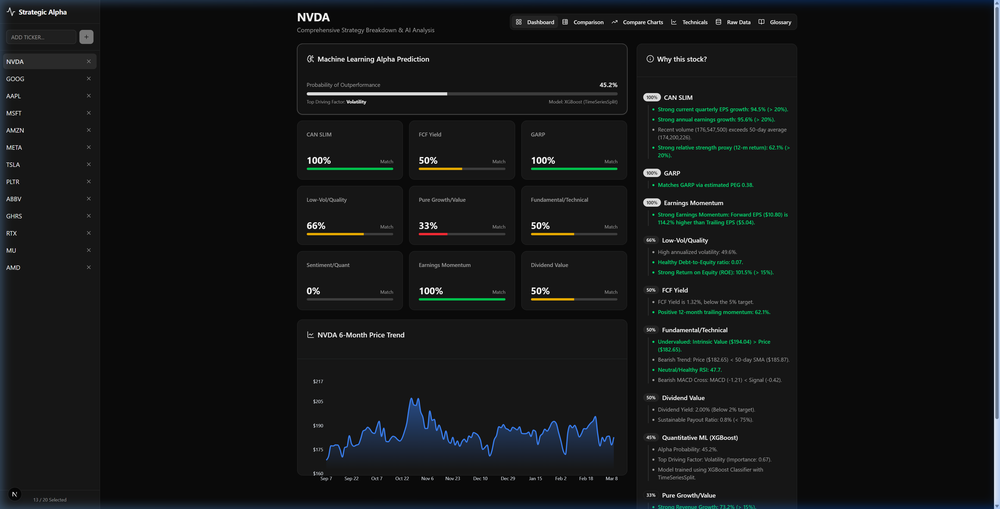
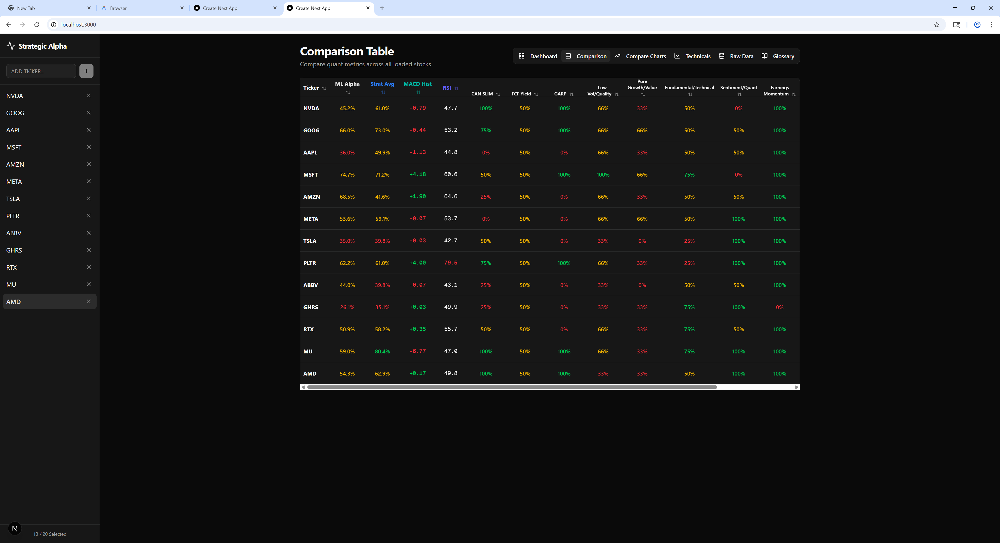
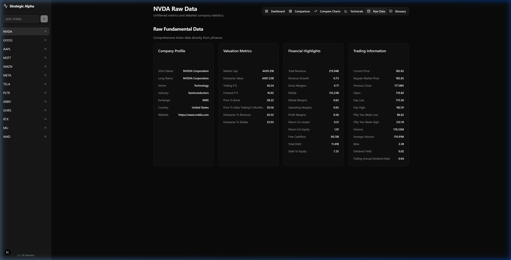
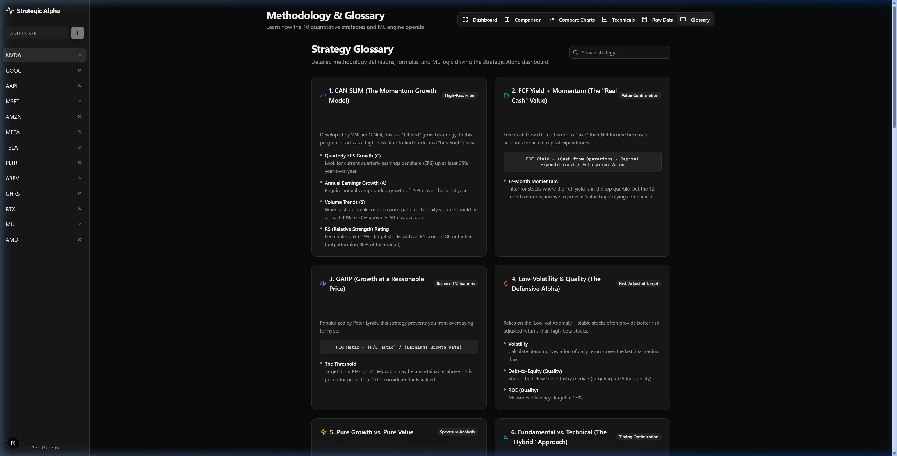
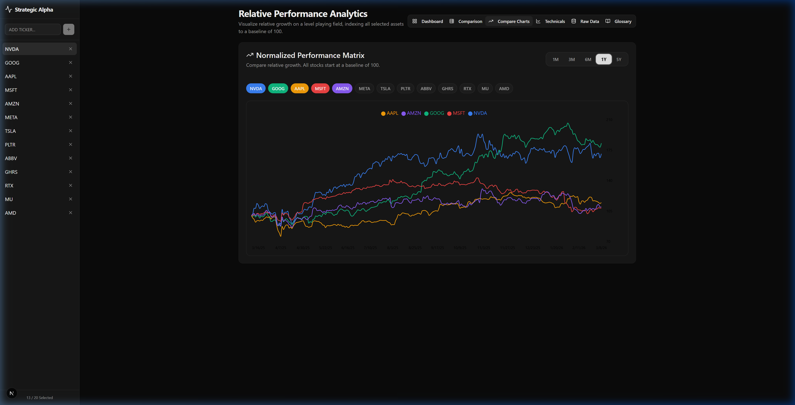
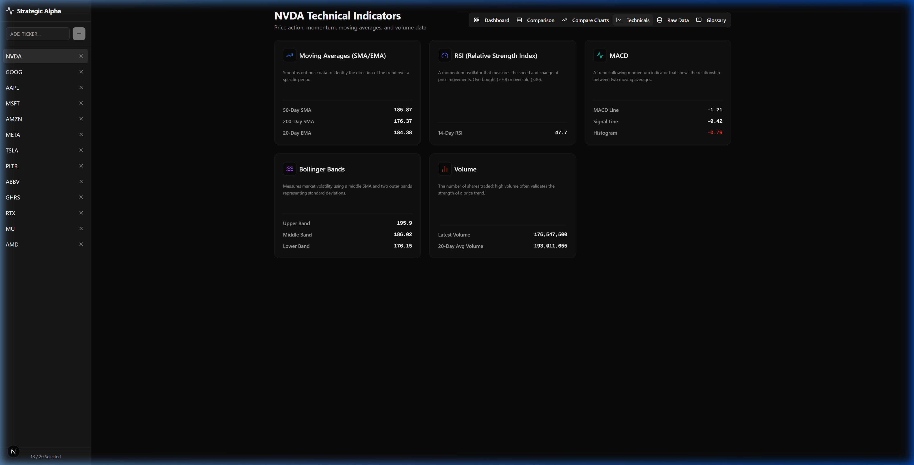

# Strategic Alpha Dashboard: Operation Guide

The Strategic Alpha Dashboard is a comprehensive, full-stack Next.js and FastAPI application designed to provide in-depth quantitative analysis and machine-learning-driven stock evaluations.

This guide outlines the core features and how to navigate the four primary views of the application.

---

## 1. Main Dashboard (Strategy Engine)

The **Main Dashboard** is the landing page and the core analytical engine of the application. It provides a deep dive into a single selected stock ticker (e.g., NVDA, AAPL).

### Key Features:
*   **Ticker Search & Selection:** Use the top navigation bar to search for and select the stock you want to analyze.
*   **Quant Factors Breakdown:** The page runs 10 distinct quantitative strategies (Value, Quality, Momentum, Volatility, CAN SLIM, FCF Yield, etc.).
*   **Match Percentages:** Each strategy receives a dynamic "Match Percentage" score indicating how well the stock fits that specific criteria.
*   **Justification Engine:** Next to the scores, the engine provides human-readable, bulleted justifications explaining *why* the stock received its score (e.g., noting strong quarterly EPS growth or a low Free Cash Flow yield).
*   **Machine Learning (Strategy 10):** The final widget displays the output of the `XGBClassifier` model, providing a probability score for Alpha outperformance based on the tracked factors.
*   **Historical Trend Chart:** A 6-month historical price trend chart is rendered using Recharts to provide immediate visual context.

---

## 2. Comparison Table View

The **Comparison Table** provides a macroscopic view, allowing you to evaluate and rank multiple stocks simultaneously against all the quantitative metrics.

### Key Features:
*   **Single-Glance Comparison:** Compare all loaded/favorited tickers side-by-side.
*   **Interactive Sorting:** Click on any column header (e.g., ML Alpha, CAN SLIM, FCF Yield) to sort the entire table ascending or descending, easily bubbling the strongest candidates to the top.
*   **Color-Coded Metrics:** Match percentages are intuitively color-coded (Green for strong matches $\ge$ 75%, Yellow for moderate, Red for weak) to quickly spot trends.
*   **6-Month Sparklines:** The far-right column features miniature, responsive trend charts for every stock in the list.
*   **Sticky Ticker Column:** When scrolling horizontally on smaller screens, the Ticker column remains locked to the left, ensuring you always know which stock you are reviewing.

---

## 3. Raw Data Exploration

The **Raw Data** page bypasses the abstracted Strategy Engine and provides direct, unfiltered access to the underlying fundamental and technical data fetched from Yahoo Finance via the `yfinance` library.

### Key Features:
*   **Comprehensive Metrics:** Exposes all ~150 data points returned by the API for the selected stock.
*   **Logical Grouping:** Information is cleanly categorized into thematic buckets:
    *   **Company Profile** (Sector, Industry, Employees)
    *   **Valuation Metrics** (Market Cap, Forward P/E, EV/EBITDA)
    *   **Financial Highlights** (Revenue, Gross Margins, Return on Equity)
    *   **Trading Information** (52-Week Range, Average Volume, Beta)
*   **Auto-Formatting:** Large financial figures are automatically formatted into readable formats (e.g., Millions (`M`), Billions (`B`)) for easier consumption.

---

## 4. Methodology & Strategy Glossary

The **Glossary** page serves as the internal documentation and mathematical reference for the dashboard's quantitative engine.

### Key Features:
*   **Strategy Definitions:** Provides detailed explanations of what each of the 10 quantitative strategies is designed to measure (e.g., "High-Pass Filter" vs "Contrarian Indicators").
*   **Mathematical Formulas:** Displays the specific financial math, thresholds, and algorithms used to calculate the Match Percentages.
*   **ML Transparency:** Details the configuration and feature sets utilized by the XGBoost Machine Learning model (Strategy 10) to generate its Alpha probability predictions.

---

## 5. Compare Charts

The **Compare Charts** view provides a normalized, relative performance view of all selected or favorited stocks on a single interactive timeline.

### Key Features:
*   **Normalized Baseline:** All assets are indexed to a starting baseline of 100 at the beginning of the selected timeframe, allowing for direct "apples-to-apples" comparison of relative growth.
*   **Interactive Timeframes:** Easily toggle between 1M, 3M, 6M, 1Y, and 5Y periods to analyze short-term volatility versus long-term resilience.
*   **Multi-Asset Plotting:** Displays distinct, color-coded line charts for multiple distinct tickers natively layered on the same matrix.

---

## 6. Technical Indicators

The **Technicals** page is dedicated to classical price action, momentum, and volume analysis, providing the underlying technical context to the core fundamental strategies.

### Key Features:
*   **Moving Averages:** Tracks standard SMA/EMA bounds (20-Day, 50-Day, 200-Day) to identify immediate trend directions and support/resistance levels.
*   **Momentum Oscillators:** Features RSI (Relative Strength Index) tracking and MACD (Moving Average Convergence Divergence) histograms to measure price movement speed and overbought/oversold conditions.
*   **Volatility & Volume:** Computes standard deviation Bollinger Bands alongside the latest trading volume versus the average 20-day volume, signaling trend viability.
